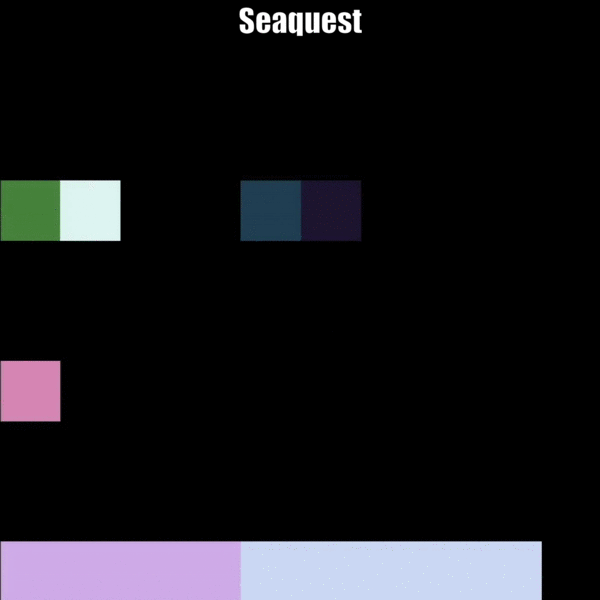
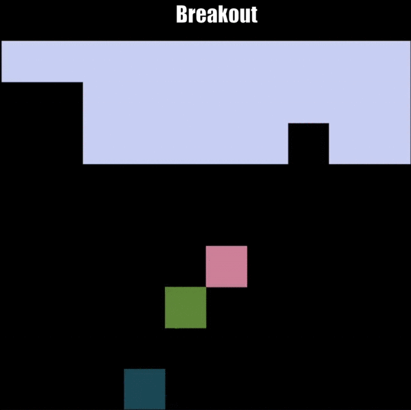
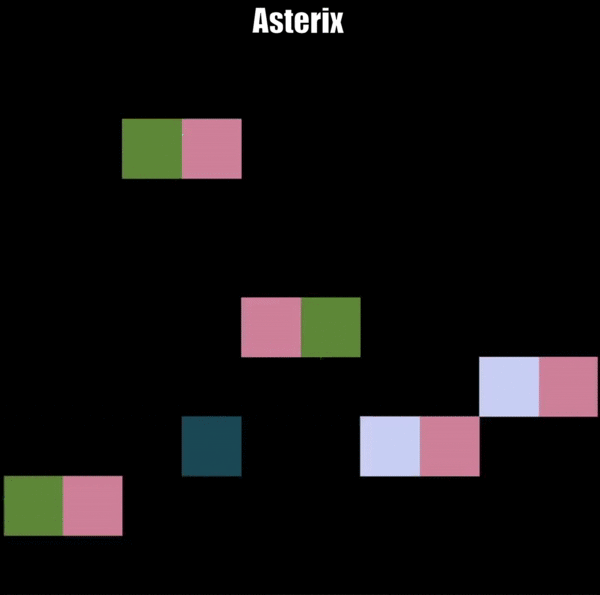
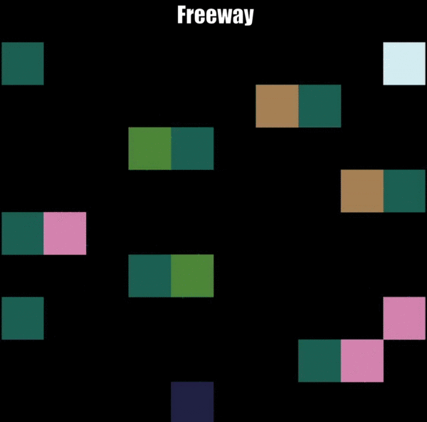
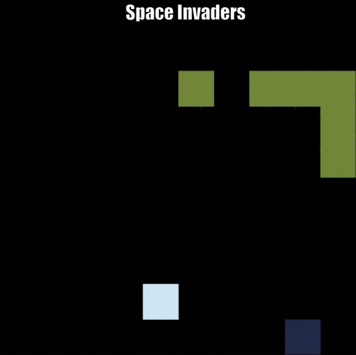
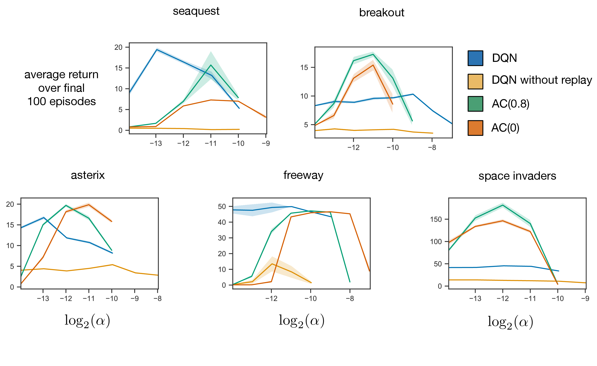
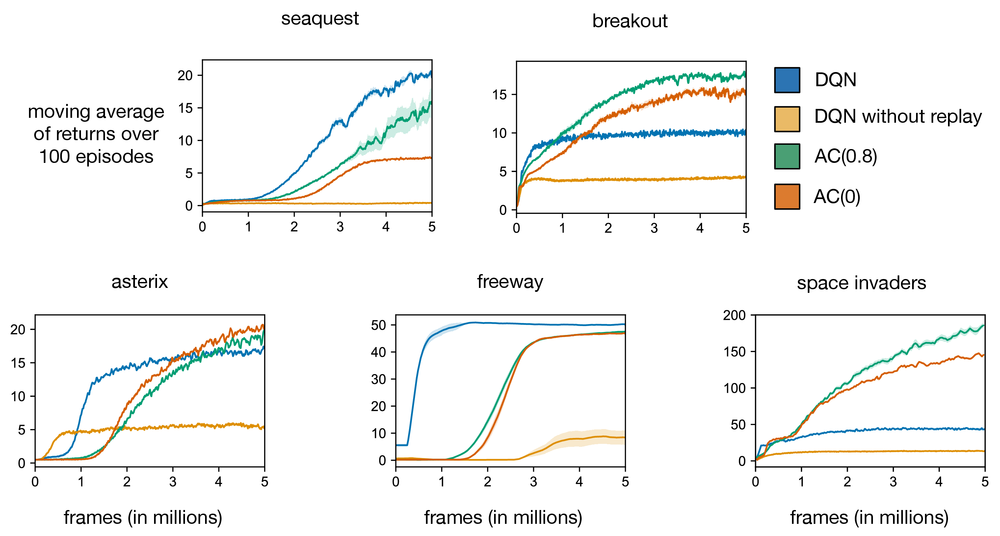

# MinAtar
MinAtar is a testbed for AI agents which implements miniaturized versions of several Atari 2600 games. MinAtar is inspired by the Arcade Learning Environment (Bellemare et. al. 2013) but simplifies the games to make experimentation with the environments more accessible and efficient. Currently, MinAtar provides analogues to five Atari games which play out on a 10x10 grid. The environments provide a 10x10xn state representation, where each of the n channels correspond to a game-specific object, such as ball, paddle and brick in the game Breakout.

<p  align="center">


</p>
<p  align="center">



</p>


## Quick Start
To use MinAtar, you need `python3` installed (make sure `pip` is also up to date).  
To run the included `DQN` and `AC_lambda` examples, you need `PyTorch`.

If you want to use a virtual environment, before installing MinAtar run

```bash
python3 -m venv venv
source venv/bin/activate
pip install --upgrade pip
```

Then you can install MinAtar either with PyPi repository or from source.

1. Via PyPi:
```bash
pip install minatar
```

2. From Source:
```bash
git clone https://github.com/kenjyoung/MinAtar.git
cd MinAtar
pip install .
```

If you have issues with automatic dependency installation, you can instead install the necessary dependencies manually and run
```bash
pip install . --no-deps
```

To install additional dependencies that are used by some examples (in particular `PyTorch`) run
```bash
pip install ".[examples]"
```

To verify that MinAtar is installed, run
```bash
python examples/random_play.py -g breakout
```
The program will run 1000 episodes with a random policy and report the mean and standard error in the resulting returns similar to:
```bash
Avg Return: 0.5+/-0.023194827009486406
```

You can replace `breakout` with one of the five available games: `asterix`, `breakout`, `freeway`, `seaquest`, and `space_invaders`.
See the Games section below for details of each game.

To play a game as a human, run
```bash
python examples/human_play.py -g <game>
```
Use the arrow keys to move and space bar to fire. Press q to quit and r to reset.

Finally, we provide a simple implementations of DQN in `dqn.py` and online actor-critic with eligibility traces in `AC_lambda.py`.


## Gymnasium Wrapper
MinAtar is fully compatible with [Gymnasium](https://gymnasium.farama.org/).
A Gymnasium environment can be constructed as follows:
```python
import gymnasium as gym
env = gym.make('MinAtar/<game-id>')
````
The following game IDs are available: Asterix-v0, Breakout-v0, Freeway-v0, Seaquest-v0, SpaceInvaders-v0, Asterix-v1, Breakout-v1, Freeway-v1, Seaquest-v1, SpaceInvaders-v1.  
For each game, in the v0 versions the action set has all 6 available actions (some of which are equivalent to no-op depending on the game),
while in the v1 versions the action set is reduced to just the minimal actions for each game.  
Note that the results included in this repo and the associated paper use the full action set of 6 actions.

> If you want to use the latest OpenAI Gym API (v0.26),
install MinAtar v1.0.13 by running `pip install minatar==1.0.13`

> If you want to use old OpenAI Gym API (without the `truncated` flag, and with the old `reset()` and `seed()` methods),
install MinAtar v1.0.11 by running `pip install minatar==1.0.11`

## Visualizing the Environments
We provide 2 ways to visualize a MinAtar environment.

### Using Environment.display_state()
The Environment class includes a simple visualizer using matplotlib in the `display_state()` function. To use it simply call:
```python
env = Environment('breakout')
env.display_state(50)
# train, do steps, ...
env.close_display()
```
or, if you're using the gym interface:
```python
import gymnasium as gym
env = gym.make('MinAtar/Breakout-v1')
env.game.display_state(50)
# train, do steps, ...
env.game.close_display()
```
The argument is the number of milliseconds to display the state before continuing execution.

This is the simplest way to visualize the environments, unless you need to handle user input during execution in which case you'd need to use the GUI class.  
You can also enable real-time rendering by making the environment in human render mode. In this case, `display_state()` will be called automatically at every step:
```python
env = gym.make('MinAtar/Breakout-v1', render_mode='human')
env.reset()
env.step(1)
```

### Using GUI class
We also include a slightly more complex GUI to visualize the environments and optionally handle user input. This GUI is used in `examples/human_play.py` to play as a human and `examples/agent_play.py` to visualize the performance of trained agents.  
To use the GUI, import it in your code with:
```python
from minatar.gui import GUI
env = Environment('breakout')
GUI(env.game_name(), env.n_channels)
```

The recommended way to use the GUI for visualizing an environment is to include all your agent-environment interaction code in a function that looks like this:
```python
def func():
    gui.display_state(env.state())
    # one step of agent-environment interaction here
    gui.update(50, func)
```
The first argument to `gui.update` is the time to hold the current frame before continuing. The second argument specifies the function to call after that time has elapsed. In the example above the call to update simply calls `func` again, effectively continuing the agent-environment interaction loop. Note that this is not a recursive call, as the call to `func` in update is made in a new thread, while the execution of the current thread continues.

To begin the execution you can use:
```python
gui.update(0, func)
gui.run()
```
This will enter the agent environment interaction loop and then run the GUI thread, `gui.run()` will block until `gui.quit()` is called. To handle user input you can use `gui.overwrite_key_handle(on_key_event, on_release_event)`. The arguments are functions to be called whenever a key is pressed, and released respectively. For an example of how to do this see `examples/human_play.py`.

## MinAtar in Other Languages
- [Julia](https://github.com/mkschleg/MinAtar.jl/blob/master/README.md)
- [JAX](https://github.com/RobertTLange/gymnax)

## Results
The following plots display results for DQN (Mnih et al., 2015) and actor-critic (AC) with eligibility traces. Our DQN agent uses a significantly smaller network compared to that of Mnih et al., 2015. We display results for DQN with and without experience reply. Our AC agent uses a similar architecture to DQN, but does not use experience replay. We display results for two values of the trace decay parameter, 0.8 and 0.0.  Each curve is the average of 30 independent runs with different random seeds. The top plots display the sensitivity of final performance to the step-size parameter, while the bottom plots display the average return during training as a function of training frames. For further information, see the paper on MinAtar available [here](https://arxiv.org/abs/1903.03176).

> The currently displayed results for Seaquest are for MinAtar v1.0.10 and lower, where a bug caused the oxygen bar to flash to full one step before running out. Results with the latest version may be different.




## Games
So far we have implemented analogues to five Atari games in MinAtar as follows. For each game, we include a link to a video of a trained DQN agent playing.

### Asterix
The player can move freely along the 4 cardinal directions. Enemies and treasure spawn from the sides. A reward of +1 is given for picking up treasure. Termination occurs if the player makes contact with an enemy. Enemy and treasure direction are indicated by a trail channel. Difficulty is periodically increased by increasing the speed and spawn rate of enemies and treasure.

[Video](https://www.youtube.com/watch?v=Eg1XsLlxwRk)

### Breakout
The player controls a paddle on the bottom of the screen and must bounce a ball to break 3 rows of bricks along the top of the screen. A reward of +1 is given for each brick broken by the ball.  When all bricks are cleared another 3 rows are added. The ball travels only along diagonals. When the ball hits the paddle it is bounced either to the left or right depending on the side of the paddle hit. When the ball hits a wall or brick, it is reflected. Termination occurs when the ball hits the bottom of the screen. The ball's direction is indicated by a trail channel.

[Video](https://www.youtube.com/watch?v=cFk4efZNNVI&t)

### Freeway
The player begins at the bottom of the screen and the motion is restricted to travelling up and down. Player speed is also restricted such that the player can only move every 3 frames. A reward of +1 is given when the player reaches the top of the screen, at which point the player is returned to the bottom. Cars travel horizontally on the screen and teleport to the other side when the edge is reached. When hit by a car, the player is returned to the bottom of the screen. Car direction and speed is indicated by 5 trail channels.  The location of the trail gives direction while the specific channel indicates how frequently the car moves (from once every frame to once every 5 frames). Each time the player successfully reaches the top of the screen, the car speeds are randomized. Termination occurs after 2500 frames have elapsed.

[Video](https://www.youtube.com/watch?v=gbj4jiTcryw)

### Seaquest
The player controls a submarine consisting of two cells, front and back, to allow direction to be determined. The player can also fire bullets from the front of the submarine. Enemies consist of submarines and fish, distinguished by the fact that submarines shoot bullets and fish do not. A reward of +1 is given each time an enemy is struck by one of the player's bullets, at which point the enemy is also removed. There are also divers which the player can move onto to pick up, doing so increments a bar indicated by another channel along the bottom of the screen. The player also has a limited supply of oxygen indicated by another bar in another channel. Oxygen degrades over time and is replenished whenever the player moves to the top of the screen as long as the player has at least one rescued diver on board. The player can carry a maximum of 6 divers. When surfacing with less than 6, one diver is removed. When surfacing with 6, all divers are removed and a reward is given for each active cell in the oxygen bar. Each time the player surfaces the difficulty is increased by increasing the spawn rate and movement speed of enemies. Termination occurs when the player is hit by an enemy fish, sub or bullet; or when oxygen reaches 0; or when the player attempts to surface with no rescued divers. Enemy and diver directions are indicated by a trail channel active in their previous location to reduce partial observability.

**Note: MinAtar v1.0.10 and lower have a bug in Seaquest which causes the oxygen bar to flash to full one time-step before termination occured due to oxygen running out. This could have a significant impact on agents which learn from one step transitions as a full oxygen bar could either mean full oxygen or imminent termination due to no oxygen. For this reason Seaquest results obtained prior to v1.0.11 may not be consistent with results obtained from v1.0.11 onward.**

[Video](https://www.youtube.com/watch?v=W9k38b5QPxA&t)

### Space Invaders
The player controls a cannon at the bottom of the screen and can shoot bullets upward at a cluster of aliens above. The aliens move across the screen until one of them hits the edge, at which point they all move down and switch directions. The current alien direction is indicated by 2 channels (one for left and one for right) one of which is active at the location of each alien. A reward of +1 is given each time an alien is shot, and that alien is also removed. The aliens will also shoot bullets back at the player. When few aliens are left, alien speed will begin to increase. When only one alien is left, it will move at one cell per frame. When a wave of aliens is fully cleared, a new one will spawn which moves at a slightly faster speed than the last. Termination occurs when an alien or bullet hits the player.

[Video](https://www.youtube.com/watch?v=W-9Ru-RDEoI)

## Citing MinAtar
If you use MinAtar in your research please cite the following paper:

Young, K. Tian, T. (2019). MinAtar: An Atari-Inspired Testbed for Thorough and Reproducible Reinforcement Learning Experiments.  *arXiv preprint arXiv:1903.03176*.

```
@Article{young19minatar,
author = {{Young}, Kenny and {Tian}, Tian},
title = {MinAtar: An Atari-Inspired Testbed for Thorough and Reproducible Reinforcement Learning Experiments},
journal = {arXiv preprint arXiv:1903.03176},
year = "2019"
}
```


## References
Bellemare, M. G., Naddaf, Y., Veness, J., & Bowling, M. (2013). The arcade learning environment: An evaluation platform for general agents. *Journal of Artificial Intelligence Research*, 47, 253–279.

Mnih, V., Kavukcuoglu, K., Silver, D., Rusu, A. A., Veness, J., Bellemare, M. G., . . . others (2015). Human-level control through deep reinforcement learning. *Nature*, 518(7540), 529.

## License
This program is free software: you can redistribute it and/or modify
it under the terms of the GNU General Public License as published by
the Free Software Foundation, either version 3 of the License, or
(at your option) any later version.

This program is distributed in the hope that it will be useful,
but WITHOUT ANY WARRANTY; without even the implied warranty of
MERCHANTABILITY or FITNESS FOR A PARTICULAR PURPOSE.  See the
GNU General Public License for more details.

You should have received a copy of the GNU General Public License
along with this program.  If not, see <http://www.gnu.org/licenses/>.
